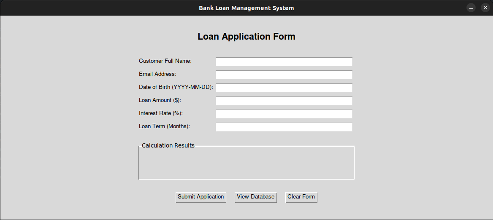
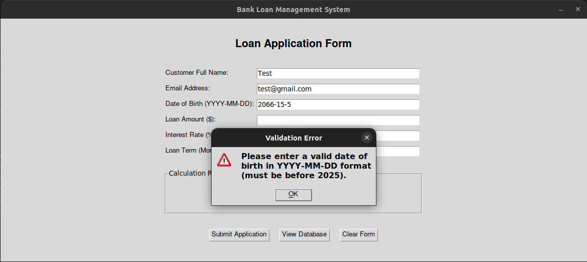
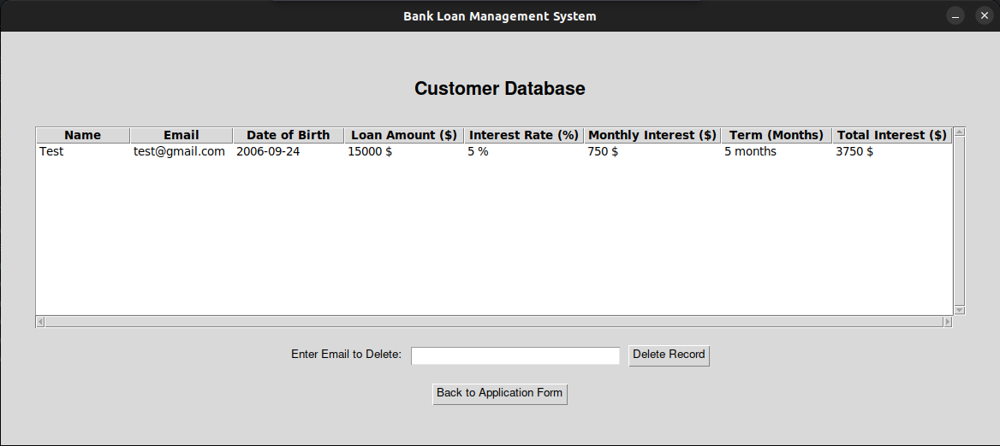
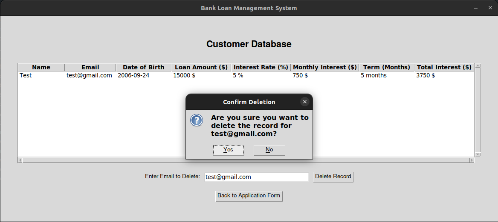

# Bank Loan Management System 🏦

A user-friendly, GUI-based **Bank Loan Management System** developed using **Python and Tkinter**. This project allows users to submit loan applications, calculate interest, and manage a database of loan applicants via CSV. It features robust error handling and a clean interface.

---

## 📁 Project Structure

```bash
Bank-System/
├── .github/
│   └── workflows/
│       └── python-tests.yml
├── assets/
│   └── screenshots/
│       ├── main_screen.png
│       ├── error_handling.png
│       ├── form_submission.png
│       ├── database_csv.png
│       └── delete_user.png
├── src/
│   ├── __init__.py
│   ├── bank_system.py
│   └── database.csv  # ignored by .gitignore
├── tests/
│   ├── __init__.py
│   └── test_bank_system.py
├── .gitignore
├── LICENSE
├── README.md
└── setup.py
```

---

## 🧠 About the Program

The application supports:

- Customer input form with validation.
- Automatic interest calculation.
- CSV-based data storage.
- Record deletion using email.
- Real-time feedback and error messages.

---

## 🚀 Features

- **Graphical Interface:** Built using Tkinter for a smooth UX.
- **Loan Form:** Capture customer name, email, DOB, loan amount, interest rate, and term.
- **Validation:** Ensures correct format of email and DOB and checks for duplicates.
- **Interest Calculations:** Automatically computes monthly and total interest.
- **Database Page:** View all records in a tabular format.
- **Delete Records:** Delete customer data based on email.
- **Persistent CSV Storage:** All submissions are saved locally in `database.csv`.


---

## 🛠 Installation & Setup

### 1️⃣ Clone the Repository

```bash
git clone https://github.com/waziri245/Bank-System.git
cd Bank-System
```

### 2️⃣ Run the Application

```bash
python src/bank_system.py
```

---

## 🛠️ How It Works

1. Launch the application,
2. Fill out the **Loan Application Form** with required fields.
3. Submit the application to calculate and store results.
4. View all saved entries in the **Database** view.
5. Delete entries by providing the registered email.

---

## 📷 Screenshots

### 🖼️ Main Screen


### ⚠️ Error Handling


### ✅ Form Submission Example


### 📄 Data Stored in CSV


### ❌ Delete User Feature


---


## 📄 License

This project is licensed under the [MIT License](LICENSE).

---

## 🧑‍💻 Author

Developed by  **Atal Abdullah Waziri**  
🎓 Co-founder of [Stellar Organization](https://stellarorganization.mystrikingly.com/).

---